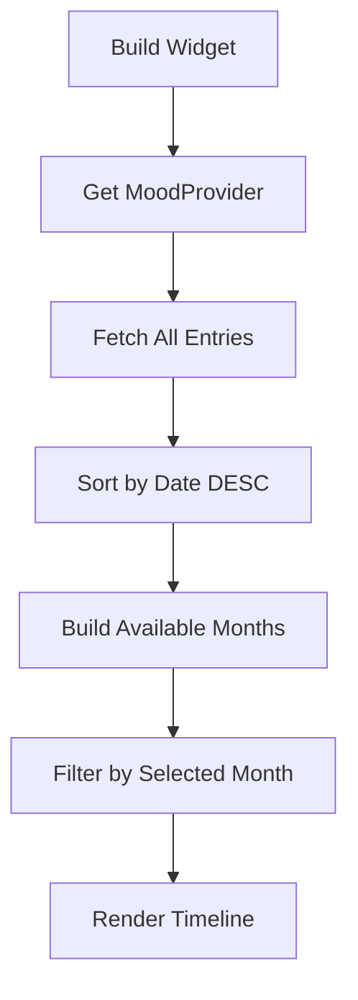

# Journal Screen Documentation

## 📖 Overview

Journal Screen (`journal_screen.dart`) is the main timeline view that displays all user entries in a chronological, month-filtered format. It serves as the primary interface for reviewing past mood entries, stories, activities, and media.

---

## 🏗️ Architecture

### File Structure
```
lib/screens/journal_screen.dart
├── JournalScreen (StatefulWidget)
│   └── _JournalScreenState
│       ├── Month filtering logic
│       ├── Timeline builder
│       └── Empty state handler
└── _JournalCard (StatefulWidget)
    └── _JournalCardState
        ├── Entry card UI
        ├── Media gallery
        ├── Activity chips
        └── Story edit dialog
```

### Dependencies
- **Providers:** `MoodProvider`, `LanguageProvider`
- **Models:** `DailyEntry`, `MoodCategory`, `PoemModel`
- **Helpers:** `LocalizationHelper`, `AppLocalizations`
- **Widgets:** `buildMediaThumbnail` (from `mood_entry_dialog.dart`)

---

## 🎨 UI Components

### 1. Month Selector
**Location:** Top of screen  
**Type:** Horizontal scrollable chips

**Features:**
- Displays all months with entries (sorted newest first)
- Always includes current month (even if empty)
- Selected month highlighted with primary color
- Auto-scrolls to selected month
- Localized month names (e.g., "Ocak 2024" in Turkish)

**Visual Design:**
```dart
Selected Chip:
- Background: Theme.primaryColor
- Text: White, bold
- Border radius: 20px
- Padding: 12h x 16v

Unselected Chip:
- Background: Transparent
- Text: Grey, normal weight
- Border: 1px grey
```

### 2. Timeline View
**Layout:** Vertical scrollable list  
**Pattern:** Entry cards with left-aligned mood indicator

**Timeline Structure:**
```
┌─────────────────────────┐
│ [Mood Icon] ─────────── │  ← Timeline dot
│    │                    │
│    │  [Entry Card]      │  ← Journal card
│    │                    │
│    ├─ ─ ─ ─ ─ ─ ─ ─ ─  │  ← Dashed connector
│    │                    │
│ [Mood Icon] ─────────── │
│    │  [Entry Card]      │
│    ●                    │  ← Last entry (solid dot)
└─────────────────────────┘
```

**Timeline Column (_buildTimelineColumn):**
- **Mood Indicator:** 40x40 circle with mood emoji
- **Connector Line:** Dashed vertical line (except last entry)
- **Colors:** Theme-aware (white/grey based on dark mode)

### 3. Journal Card (_JournalCard)
**Design:** Material card with rounded corners

**Card Sections (Top to Bottom):**

#### Header
- **Date:** Day of week + date (e.g., "Pazartesi, 29 Ocak")
- **Mood Badge:** Rounded chip with emoji + name
- **Edit Button:** Opens `DailyDetailScreen` for editing

#### Media Section (_buildPhotoSection)
**Layouts:**
- **Single Media:** Large 200px height, full width
- **Multiple Media:** Horizontal scroll, 180px height, 150px width each
- **Video Support:** Shows play icon overlay (via `buildMediaThumbnail`)
- **Tap Action:** Opens `FullScreenGallery` with zoom

#### Story Section
**Display:**
- **Story Text:** Generated or custom story
- **Edit Icon:** Pencil icon to modify story
- **Typography:** 
  - Default: 14px, grey color
  - Edited: Italic style
- **Edit Dialog:** Modal with TextField + Save/Cancel

#### Activity Chips (_buildActivityChips)
**Layout:** Wrap layout with horizontal scroll
- **Chip Style:** Rounded, grey background
- **Icons:** Activity-specific (via `LocalizationHelper`)
- **Labels:** Localized activity names

### 4. Empty State (_buildEmptyState)
**Shown When:** No entries in selected month

**Content:**
- Icon: `LineIcons.book` (64px, grey)
- Title: "Bu ayda kayıt yok" (localized)
- Subtitle: Encouragement message
- Styling: Centered, muted colors

---

## 🔄 Data Flow

### Entry Loading


### Month Selection
```dart
User taps month chip
  → Update _selectedMonth state
  → Rebuild widget
  → Filter entries for new month
  → Render filtered timeline
```

### Entry Editing
```dart
User taps edit icon
  → Navigate to DailyDetailScreen(date: entry.date)
  → User edits entry in detail screen
  → Pop back to journal
  → Provider auto-updates
  → Journal rebuilds with new data
```

---

## 🎯 Key Features

### 1. Media Gallery Integration
- **Thumbnail Display:** Uses `buildMediaThumbnail` helper
- **File Type Detection:** 
  - Images: `.jpg`, `.jpeg`, `.png`, `.heic`, `.webp`
  - Videos: `.mp4`, `.mov`, `.avi` (shows play icon)
- **Full Screen View:** Tap to open `FullScreenGallery`
- **Multi-select:** Displays up to 5 media items per entry

### 2. Story Editing
**Inline Edit Flow:**
1. Tap edit icon on story
2. Modal dialog appears with current text
3. Edit in TextField (multiline)
4. Save → Updates `entry.customStory`
5. Cancel → Discards changes

**Story Priority:**
- `customStory` (if edited) > `savedStory` (auto-generated)

### 3. Activity Display
**Dynamic Chips:**
- Only shows completed activities (`activity == true`)
- Icons mapped via `LocalizationHelper.getActivityIcon()`
- Names localized via `LocalizationHelper.getActivityName()`
- Responsive layout with horizontal scroll

### 4. Mood Integration
**Visual Indicators:**
- Timeline dots colored by mood
- Mood badge in card header
- Emoji representation from `MoodCategory`

---

## 🛠️ Technical Details

### State Management
**Local State:**
- `_selectedMonth` - Current month filter
- `_availableMonths` - List of months with entries

**Provider State:**
- Uses `MoodProvider` for entry data
- Listens to changes for auto-rebuild
- No local caching (always fresh data)

### Performance Optimizations
1. **Lazy Loading:** ListView.builder for large lists
2. **Month Indexing:** Pre-builds month list for fast filtering
3. **Widget Splitting:** Separate `_JournalCard` for better rebuild performance
4. **Constants:** Reuses constant values (padding, sizes)

### Localization
**Localized Elements:**
- Month names (`DateFormat.yMMMM`)
- Weekday names (`DateFormat.EEEE`)
- Mood names (`LocalizationHelper.getMoodName`)
- Activity names (`LocalizationHelper.getActivityName`)
- UI labels (via `AppLocalizations`)

**Language Support:**
- Dynamic switching (no app restart needed)
- RTL-ready layout structure

---

## 📐 Design Specifications

### Colors
```dart
Card Background:
  Light: Theme.cardColor
  Dark: Theme.cardColor

Timeline Dot:
  Border: mood.color
  Fill: mood.color.withValues(alpha: 0.2)

Mood Badge:
  Background: mood.color.withValues(alpha: 0.15)
  Text: mood.color

Activity Chips:
  Background: isDark ? Colors.white12 : Colors.grey[200]
  Text: isDark ? Colors.white70 : Colors.black87
```

### Spacing
```dart
Card Padding: 16px all sides
Card Margin: 16h, 12v
Media Height: 180-200px
Photo Grid Gap: 8px
Activity Chip Spacing: 8px horizontal
Timeline Dot Size: 40x40
Section Spacing: 16px vertical
```

### Typography
```dart
Date: Poppins, 12px, grey, w600
Mood Name: Poppins, 12px, mood.color, w600
Story: Poppins, 14px, grey
Activity Label: Poppins, 12px
Empty State Title: Poppins, 18px, w600
```

---

## 🔧 Code Examples

### Filter Entries by Month
```dart
final filteredEntries = allEntries.where((entry) {
  return entry.date.year == _selectedMonth.year &&
         entry.date.month == _selectedMonth.month;
}).toList();
```

### Open Edit Screen
```dart
Navigator.push(
  context,
  MaterialPageRoute(
    builder: (context) => DailyDetailScreen(
      initialDate: entry.date,
    ),
  ),
);
```

### Media Thumbnail Display
```dart
buildMediaThumbnail(
  paths[index],
  width: 150,
  height: 180,
)
```

---

## 🐛 Known Issues & Limitations

### Current Limitations
1. **Media Display:** Videos show placeholder (playback not implemented)
2. **Pagination:** Loads all entries for selected month (may slow with 100+ entries)
3. **Search:** No search/filter functionality within month
4. **Export:** No entry-specific export from journal view

### Future Enhancements
- [ ] Video playback in gallery
- [ ] Search within entries
- [ ] Multi-month view toggle
- [ ] Quick filters (by mood, activity)
- [ ] Pagination for large datasets
- [ ] Swipe actions (delete, share)

---

## 📦 Related Files

- [`daily_detail_screen.dart`](file:///c:/Users/Yadeliya/Desktop/Projelerim/poem_diary-main/poem_diary/lib/screens/daily_detail_screen.dart) - Edit entry screen
- [`full_screen_gallery.dart`](file:///c:/Users/Yadeliya/Desktop/Projelerim/poem_diary-main/poem_diary/lib/screens/full_screen_gallery.dart) - Media viewer
- [`mood_entry_dialog.dart`](file:///c:/Users/Yadeliya/Desktop/Projelerim/poem_diary-main/poem_diary/lib/widgets/mood_entry_dialog.dart) - Entry form + buildMediaThumbnail
- [`localization_helper.dart`](file:///c:/Users/Yadeliya/Desktop/Projelerim/poem_diary-main/poem_diary/lib/helpers/localization_helper.dart) - Activity/mood name mapping

---

## 📝 Maintenance Notes

### Adding New Features
1. **New Card Section:** Add in `_JournalCard.build()` after existing sections
2. **New Filter:** Extend `_buildAvailableMonths()` logic
3. **New Action:** Add button in card header row

### Testing Checklist
- [ ] Empty month display
- [ ] Month with single entry
- [ ] Month with 10+ entries
- [ ] Entry with no media
- [ ] Entry with 5 media items
- [ ] Entry with video files
- [ ] Story editing (save/cancel)
- [ ] Language switching
- [ ] Theme switching (light/dark)
- [ ] Navigation to edit screen
- [ ] Media gallery full screen
